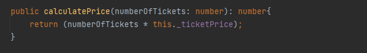
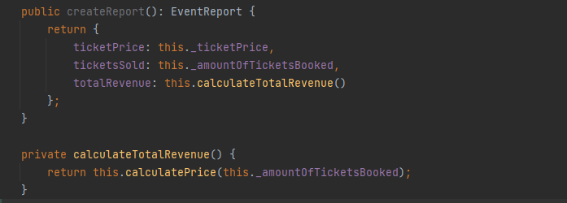
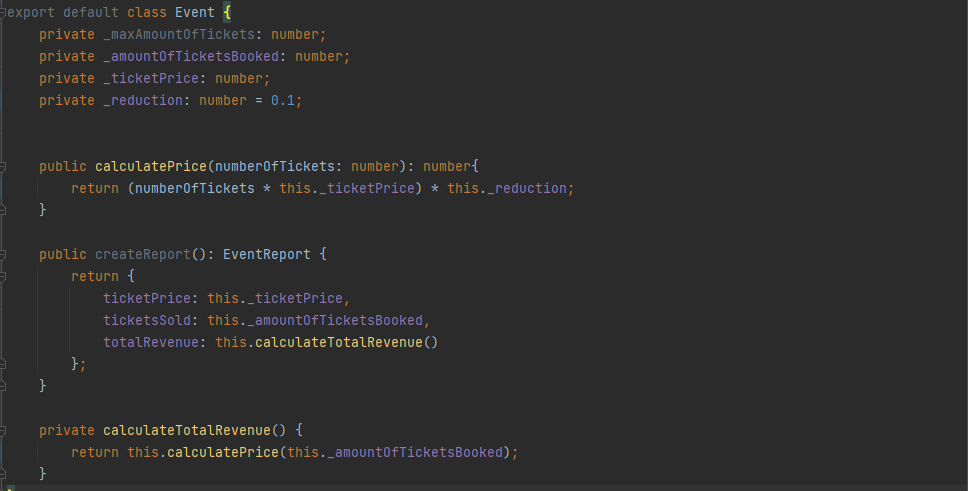

Single Responsibility Principle
===============================

Het Single Responsibility Principe helpt je bij beslissingen over hoe je de vereiste functionaliteit van een applicatie
over verschillende klassen verdeeld. Het idee bestaat er uit de functionaliteit van een klasse maar relevant is voor bijvoorbeeld
één type van gebruiker of actor. 

Waarom dat van belang is, illustreert het voorbeeld hieronder.

Beeld je even in dat deze klasse onderdeel is van een applicatie waar mensen voor optredens of feestjes tickets kunnen boeken
(de user interface, API en dataopslag laten we buiten beschouwing).

Momenteel zit er in de klasse enkel de nodige data om de financiële kant af te handelen. Via onderstaande methode 
kan een klant de prijs van bestelling krijgen. 

Voor de mensen van de boekhouding wordt via de volgende methode een kort rapport gemaakt van de ticketverkoop.

Wat zou er hier kunnen mislopen? 

Stel dat er een nieuwe requirement wordt gedefineerd om aan de klant een korting op het event
te geven. Hiervoor hoeft een developer slechts de _calculatePrice_ methode aan te passen, deze wordt zowel voor de klant als de
boekhouding gebruikt. De code zou er dan bijvoorbeeld zo kunnen uitzien:

Dus geen probleem? Wel, daar heeft de boekhouding een andere mening over. Om de bruto omzet te berekenen gebruiken
zij de prijs zonder korting. Vervolgens wordt daar dan de korting als kost ingebracht om de neto omzet te berekenen.
De berekingswijze in ons systeem wijkt hier van af: in de totalRevenue is de korting nu al wel verekend. Wanneer het boekhoudsysteem
deze gegevens verwerkt, staat de boekhouding plots vol fouten.

De logica voor twee heel verschillende actoren in het systeem, nl de klant en boekhouding,
is hier verstrengeld  geraakt. Aanvankeljk vormde dat geen probleem omdat het concept van een prijs zowel binnnen de context
voor een klant als de boekhouding erg op elkaar leek. Maar naarmate de applicatie groeide en complexer werd bleek dit niet meer
het geval te zijn. Het was een vergissing om deze functionaliteit samen te zetten.

Uiteraard is dit een zeer simpel voorbeeld en zou je kunnen argumenteren dat als de user story goed beschreven 
zou zijn, de developer deze vergissing niet zou maken. In de realiteit worden dergelijke fouten toch snel gemaakt.
User stories zijn vaak beperkt en vaag, klassen zijn groot en complex waardoor de verstrengeling niet opvalt,...

Probeer zelf deze code zo te herschrijven zodat een probleem als dit niet meer zou kunnen voorkomen.
